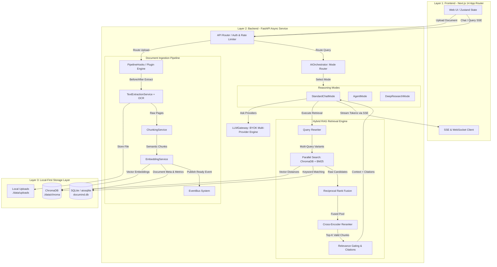
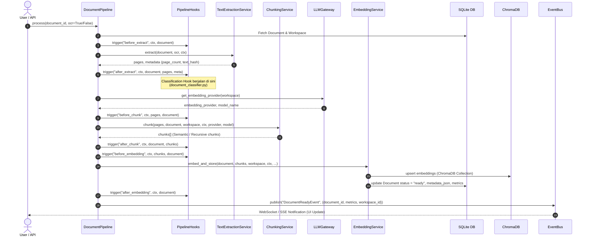
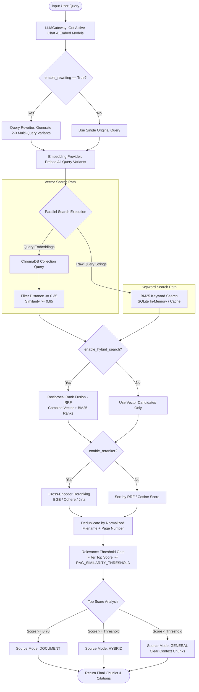
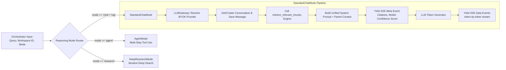
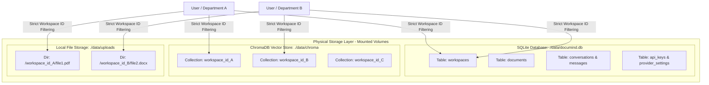

# ORLITH AI: Full System Pipeline & Architecture Documentation

Dokumen ini menjelaskan alur kerja (*pipeline*) sistem secara menyeluruh (*end-to-end*) pada platform **ORLITH AI**. Sistem ini dirancang dengan arsitektur modular berlapis yang memisahkan antara abstraksi model AI (*LLM Gateway*), pemrosesan dokumen asinkron (*Document Pipeline*), mesin pencarian hibrida (*Hybrid RAG Retrieval Engine*), dan antarmuka pengguna berbasis *real-time streaming* (Next.js + SSE/WebSocket).

---

## 🌐 1. Arsitektur Umum & Alur Kerja Utama (High-Level System Flow)

Secara garis besar, siklus data di dalam **ORLITH AI** terbagi menjadi dua jalur utama:
1. **Ingestion & Indexing Pipeline (Jalur Asinkron):** Mengubah file fisik (PDF, DOCX, TXT) menjadi pecahan teks semantik (*chunks*) dan *vector embeddings* yang disimpan secara terisolasi per *workspace*.
2. **Retrieval & Generation Pipeline (Jalur Sinkron/Real-Time):** Memproses kueri pengguna melalui *Multi-Query Rewriting*, pencarian ganda (*Hybrid Search: Vector + BM25*), penggabungan peringkat (*Reciprocal Rank Fusion / RRF*), *Reranking*, hingga menghasilkan jawaban *stream* dengan sitasi akurat.

---

## 📄 2. Document Ingestion & Vectorization Pipeline (`DocumentPipeline`)

Dikelola oleh `services.pipeline.DocumentPipeline`, proses ini dieksekusi secara latar belakang (*background task*) dengan sistem *Hook Engine* (`PipelineHooks`) yang memungkinkan penyisipan validasi atau klasifikasi tambahan pada setiap tahap proses.

### Tahapan Detail Ingestion:
1. **Inisialisasi & Hook Execution (`before_extract`):** Mengambil data dokumen dan konfigurasi *workspace* dari database SQLite (`aiosqlite`).
2. **Ekstraksi Teks (`TextExtractionService`):** Mengesktrak teks dari halaman per halaman. Jika parameter `ocr=True` aktif atau teks berbasis gambar/hasil scan terdeteksi, sistem menjalankan proses Optical Character Recognition (OCR).
3. **Klasifikasi Dokumen (`after_extract`):** `classification_hook` mendeteksi tipe dan struktur dokumen secara otomatis dari metadata dan konten yang diekstrak.
4. **Setup Provider (`LLMGateway`):** Menentukan mesin *embedding* yang aktif pada *workspace* tersebut (bisa berupa OpenAI, HuggingFace, Cohere, atau **Ollama local embedding**).
5. **Semantic Text Chunking (`ChunkingService`):** Memecah halaman menjadi segmen teks bermakna dengan mempertahankan konteks paragraf dan batasan token optimal.
6. **Vector Upsert (`EmbeddingService`):** Menghasilkan vektor untuk setiap *chunk* dan menyimpannya langsung ke dalam **ChromaDB** pada *collection* khusus *workspace_id* bersangkutan.
7. **Finalization & Event Bus (`EventBus`):** Menyimpan riwayat latensi (*metrics* & *status_history*) ke DB, mengubah status dokumen menjadi `ready`, dan memancarkan `DocumentReadyEvent` agar antarmuka pengguna (Next.js) memperbarui status di UI secara *real-time*.

---

## 🔍 3. Hybrid RAG Retrieval Engine (`retrieve_relevant_chunks`)

Saat pengguna mengirimkan pertanyaan pada mode *Chat/RAG*, sistem tidak sekadar mencocokkan *cosine similarity* standar, melainkan menjalankan **pipeline pencarian hibrida multi-tahap** untuk memastikan relevansi dan akurasi maksimal (`services.ai.retrieval.search`).

### Tahapan Detail Retrieval:
1. **Multi-Query Rewriting (`rewrite_query`):** Menggunakan model LLM aktif untuk memperluas kueri awal pengguna menjadi 2-3 variasi kueri alternatif guna menangkap sinonim dan maksud tersembunyi.
2. **Parallel Retrieval Execution (`asyncio.gather`):**
   - **Vector Path (`ChromaDB`):** Mencari *n_results* teratas dari vektor *embeddings* dan memvalidasi batas jarak (*cosine distance* $\le 0.35$).
   - **Keyword Path (`retrieve_bm25`):** Mencari kecocokan kata kunci eksak menggunakan algoritma BM25 pada indeks teks dokumen.
3. **Reciprocal Rank Fusion (`RRF`):** Menggabungkan urutan peringkat dari *Vector Search* dan *BM25 Keyword Search* menjadi satu daftar kandidat terkonsolidasi yang kebal terhadap pembobotan skor absolut.
4. **Cross-Encoder Reranking (`execute_rerank`):** Memproses ulang kandidat menggunakan model *Reranker* khusus (seperti BGE/Cohere) untuk memberi skor presisi hubungan semantik antara kueri dan teks *chunk*.
5. **Deduplication (`normalize_filename` + `page_number`):** Menghapus duplikasi *chunk* yang berasal dari versi dokumen yang sama pada halaman yang sama.
6. **Relevance Gating & Source Mode:**
   - **`DOCUMENT` (Score $\ge 0.70$):** Jawaban didasarkan murni pada bukti dokumen.
   - **`HYBRID` (Score $\ge$ Threshold):** Menggabungkan konteks dokumen dengan pengetahuan umum model.
   - **`GENERAL` (Score $<$ Threshold):** Jika dokumen tidak relevan, *chunk* dikosongkan dan model menjawab dari pengetahuan umum (atau menolak menjawab sesuai instruksi sistem).

---

## 🤖 4. Multi-Mode AI Orchestration & SSE Streaming (`AIOrchestrator`)

Saat kueri selesai melalui tahap *retrieval*, `services.ai.orchestrator.AIOrchestrator` menentukan jalur penalaran (*reasoning mode*) yang tepat sebelum mengirimkan *stream output* ke pengguna.

### Multi-Provider BYOK Gateway (`LLMGateway`):
Platform ini mendukung pengalihan model secara dinamis tanpa mengubah kode aplikasi. `LLMGateway` mengenkripsi dan mendekripsi kunci rahasia (*API Keys*) menggunakan *Fernet Encryption* serta mendukung *provider* berikut:
- **Cloud Providers:** OpenAI (`gpt-4o`, `gpt-4o-mini`), Anthropic (`claude-3-5-sonnet`), Google Gemini, Mistral AI, DeepSeek, OpenRouter.
- **Local & Offline Providers:** **Ollama** (`llama3`, `mistral`, `qwen`, dll) dan Local HuggingFace embeddings untuk jaminan keamanan data 100% *air-gapped*.

---

## 🛡️ 5. Isolasi Multi-Tenant & Struktur Penyimpanan Data

Keamanan dan isolasi data antar organisasi/departemen dijaga secara ketat oleh arsitektur **Granular Workspaces**:

- **Database Relasional (`aiosqlite`):** Setiap *query* selalu menyertakan `workspace_id` sebagai *foreign key filter* utama.
- **Vector Index Isolations:** ChromaDB membuat *collection* terpisah dengan pengenal `workspace.id`. Ruang pencarian vektor tidak akan pernah bercampur antar *workspace*.
- **File Storage Structure:** File fisik yang diunggah disimpan dengan partisi direktori berdasarkan ID *workspace* dan ID dokumen di `./data/uploads`.

---

## ⚡ 6. DevOps, Lifecycle & Production Hardening

Agar sistem tahan banting saat dijalankan pada lingkungan produksi skala besar, sistem mengintegrasikan lapisan keandalan (*reliability hooks*):

1. **Structured JSON Logging (`structlog`):**
   Seluruh aktivitas *pipeline* (seperti latensi ekstraksi, *metrics* *chunking*, latensi *fusion RRF*, dan *error stack trace*) dicatat dalam format JSON yang mudah dipindai oleh alat pemantauan (*log aggregator* seperti ELK atau Datadog).
2. **Global Rate-Limiting (`slowapi`):**
   Mencegah *denial of service* (DoS) atau lonjakan biaya tak terduga dari panggilan API LLM secara berlebihan pada level *router* FastAPI.
3. **Exponential Backoff Resilience (`tenacity`):**
   Jika terjadi *timeout* jaringan atau kegagalan sementara saat memanggil penyedia AI eksternal (OpenAI/Anthropic/Ollama), `tenacity` akan melakukan coba ulang (*retry*) secara otomatis dengan jeda waktu eksponensial.
4. **Health Checking Metrics (`/health`):**
   Kontainer Docker memonitor ketersediaan *database*, *vector store*, dan *AI provider Gateway* setiap 30 detik melalui integrasi `healthcheck` di `docker-compose.yml`.
